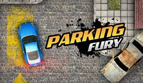
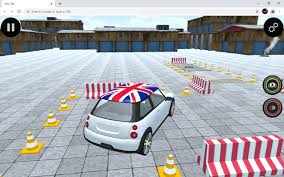
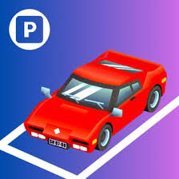

# Year 9 Computing Technology Assessment Task 3
# By Sebastian Tam - 9CT1B
## Identifying and Defining
### Brainstorming for Game
- Vehicle (car)
- Help with driving
- Parking
- Many levels that you can see how many at the start
- Add visibility issues like fog to recreate real life.
- Obstacles like sidewalks and other cars.
### Identify the Need
#### **Need:** 
To improve people's fine motor skills and hand-eye coordination with a fun game. 
The game is about knowing how to park your car, so it can also help young people 
(around 8-15 years old) for the future when they drive their car.
#### **Problem Statement:** 
Kids in the future will eventually drive cars, so after playing this 
game, they will know the rules of it and how to park a car. With a car parking game, people 
will learn how to park and can avoid the obstacles on the side, to help in the future
when getting their drivers licence and driving a car.
#### **Skill Development:** 
To develop the skills to make the game, I will watch Mr. Scott's tutorials for refreshing 
on how to make things move. 

### Requirements Outline
#### Inputs
- The user will input either WASD or arrow keys to move the car
- They can also use the left click mouse to press buttons in the user interface
#### Processing
- The program will check that it hasn't hit any colliders and will move it to where it should be, like forward or at a turn
- Once a level is finished, the game will act accordingly and will activate the next level
#### Outputs
- The game will update the postion of the player after the input is recieved
- If they die it will show a message of "Would you like to try again?" or "Quit" option
#### Transmission
- The game will save the data to the computer or laptop that the game is played on and they will be the only one that can see their results
- This game won't have public scores that other's can see
#### Storage
- After finishing the game or the session that they play, the game will save to the local cloud so that the user can continue where they picked off
- It will save the level that they are up to and the levels they have completed.

### Functional Requirements
#### User Interaction
- The users will interact with the game with keyboard inputs. W & up arrow - forward, A & left arrow - left, S & down arrow - backward, D & left arrow - right
- The users will also use the left click mouse to navigate the User Interface and to select options
#### Core Gameplay
- The main function or action in this game is movement, as it is how the car moves and is the point of the game
- The key will be pressed -> The game will sense it -> The position of your character will be moved according (for example: the user will press either the W or up arrow key, and their car will move forward)
#### Scoring and Feeback
- There will be a message at the end of each level to say that you have completed it. It will then ask if you want to go to the next level. Feedback will also be given if you hit an obstacle (like another car)
- The "next level" response will be activated if you complete the level, and the "hit another obstacle" response will be activated if you hit the obstacle while parking
#### Level Progression
- This game will have multiple levels, and once you succeed in parking a car the right way, you will go to the next level
- The levels will get progressively harder to make the game more interesting
#### Saving and Loading data
- The project will save the user's progress locally to their device
- The game will load the recent data the next time they load the game

### Non-Functional Requirements
#### Performance Requirements
- The game should load in around 4 seconds
- It should respond to the inputs from users as fast as possible, and there should be no noticeable lag
#### Usability Requirements
- The UI will be easy to navigate with clear and easy to use buttons
- There will also be a tutorial so people know what to do, as well as a practice level
#### Scalability Requirements
- The game should be able to be expanded with more levels as more people complete the game
- The game will have new cars to choose from so that the game can be expanded to be more fun

### Consideration of Social and Ethical Issues
#### Define the following terms:
**Equity:** Equity mean fairness and justice.\
**Accessibility:** Accessibilty means to be able to be entered or reached no matter who you are.
#### Accessibility
My project will be able to be use by people of all abilities, as it is very easy to play and to navigate. My game will have an option to have the list of rules all on the screen instead of the tutorial if it is easier for them to read and understand the game like that.
#### Privacy and Data Protection
My project will collect user data, but it will only save the level that the user is up to. It will also save what cars they have unlocked, however only they will be able to view it.
#### Fairness and Representation
My project wont have any stereotypes or bias, and there will be no characters. The only thing in my game will be cars, so that will avoid harmful stereotypes compared to if there are characters.
#### Mental and Emotional Well-Being
My game won't affect the users' mental health as mine is a peaceful game, compared to games with violence like First Person Shooter games. Mine won't have scary scenarios so it will be peaceful but still fun.
#### Cultural Sensitivities
The content in my game won't be offensive or rude to different cultures as I will avoid putting symbols on the map. The maps and cars will be random so it shouldn't be inappropriate or misunderstood by users from different cultural backgrounds.

## Research and Planning
### PMI
| Existing Game | Plus | Minus | Implication |
| :----| :----| :----| :----|
| Parking Fury   | It helps people drive cars and park it. It can help people's fine motor skills and hand eye coordination as it has a rule where if you touch another car or an object you lose a life. It also saves your progess if you are on the same device. | It doesn't have many levels, but there are multiples jobs in each level, and it doesn't have different weather conditions. | I will try to do something similar to this, but instead of 3 seperate games I will do it all in one go, and I will try to add different weather conditions to make the game more realistic. I will also use the movement in this game. |
| Car Parking Master Game  | It helps teach you how to park a car in different scenarios, and it help's people learn how to drive a car as well. It has obstacles on the side and if you hit it you die and have to restart the level. There are also different cars that you can use at the start. | The game gets boring over time as you have to repeat the same levels everytime you load in, and it isn't realistic as there are only cones, compared to other cars being in the game. | I will try to make my game like this in the way that there are multiple cars, however I will make it like an achievement after reaching a certain amount of levels. |
| Parkmania  | It has lots of obstacles to help people learn how to drive and to park their car. | It is annoying that you have to finish in an exact point even after you park in between the lines, and it is a bit unrealistic as you can drift in the game, but not in reallife. | My game might be similar to this as there are other cars to make the game more realistic, but I won't add the movement for this game. |

### Flowcharts and Pseudocodes
#### User Interaction

#### Core Gameplay

#### Scoring and Feedback

#### Level Progression

#### Saving and Loading Data
